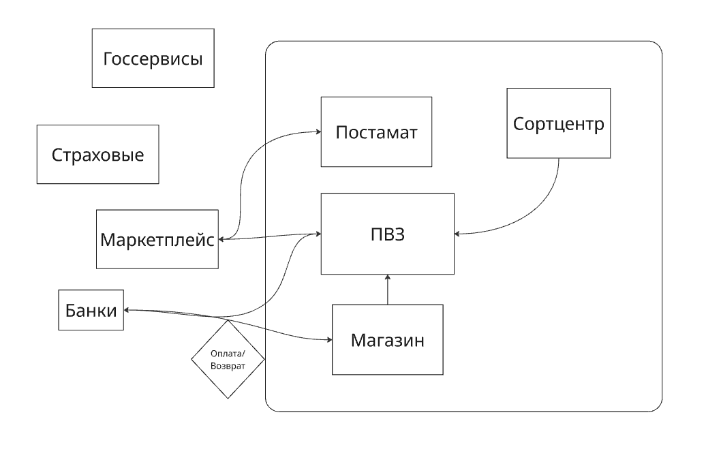

# Описание системы и Проблема

Система работает и как служба доставки, и как агент партнёров: маркетплейсов, банков, страховых компаний. Она позволяет потребителям забрать товар, купленный на маркетплейсе (Покупатель заказывает товар на маркетплейсе, выбирает доставку через нашу сеть доставки, мы доставляем до пункта назначения, ждем подтверждение оплаты от маркетплейса, выдаем товар) и отправить посылку через нашу сеть (Отправитель приносит товар в пвз, мы доставляем, оплата может быть как при отправке так и при получении). Обязанности самой системы: приём товара (посылки), построение маршрута, доставка до пункта выдачи, проверка оплату, выдача товара.

## Возникающие проблемы

* **ситуации, когда платёж не определён в момент выдачи:** товар выдан, а подтверждение потеряно. Компания теряет деньги или получает спор с партнёром и клиентом;
* **ручные и долгие сверки с партнёрами** по наложенному платежу и агентским операциям. Расхождения увеличиваются, деньги партнёрам перечисляются с задержкой;
* **конфликты с франчайзи:** кто отвечает за недостачу;
* **проблемы с SLA** **на совмещённых площадках** (процессы магазина и ПВЗ конкурируют за один канал связи)

## Ценность системы

* своевременное подтверждение выдачи, в том числе при работе точки офлайн с последующей синхронизацией;
* автоматические сверки с партнёрами
* быстрое подключение новых партнёров (франчайзи) без доработки каждой точки;
* прозрачность SLA по каждой точке и каждому каналу.

# Границы системы

## **Внутри системы:**

* **ПВЗ.** Приём посылок от отправителей, выдача товаров получателям, проверка оплаты перед выдачей.
* **Постаматы.** Выдача заказов маркетплейсов без участия сотрудника.
* **Сортцентры.** Сортировка посылок и построение маршрута до пункта выдачи.
* **Магазины (совмещённые площадки).** Продажа и оплата на месте, передача заказов в ПВЗ на той же площадке.

## **Внешние участники, с которыми система обменивается данными:**

* **Маркетплейсы.** Передают заказы на доставку в ПВЗ и постаматы и подтверждают оплату; система возвращает им статус выдачи.
* **Банки.** Проводят оплату и возвраты в ПВЗ и магазинах.
* **Страховые компании.** Партнёры, для которых система может выполнять агентские операции.
* **Госсервисы.** Внешний участник для отдельных операций (например, проверки личности получателя).

## **Не входит в систему:**

сайты и приложения маркетплейсов, внутренние системы банков.

# Карта стейкхолдеров

1. Руководитель компании (внутренний стейкхолдер, отвечает за рост системы и прибыли, сокращение потерь, имеет высокое влияние)
2. Финансовый отдел (внутренний стейкхолдер, отвечает за сверки и финансовые переводы, имеет высокое влияние)
3. Сотрудники ПВЗ и курьеры (внутренний стейкхолдер, отвечает за выдачу товара, имеет низкое влияние)
4. ИТ-поддержка (внутренний стейкхолдер, отвечает за работу ИТ-системы, имеет среднее влияние)
5. Маркетплейсы (внешний стейкхолдер, отвечает за передачу товаров в доставку и подтверждение оплаты, имеет высокое влияние)
6. Банки (внешний стейкхолдер, отвечает за платежи и финансовые операции, имеет высокое влияние)
7. Франчайзи ПВЗ (внешний стейкхолдер, отвечает за работу и порядок на ПВЗ, имеет среднее влияние)
8. Покупатели и отправители (внешний стейкхолдер, отвечает за оплату заказанных товаров, имеет среднее влияние)

# Этап жизненного цикла

Система уже существует и работает (этап эксплуатации). Но она выросла: стало много точек и франчайзи, появились потери из-за неподтверждённых платежей и долгие ручные сверки. Поэтому систему нужно дорабатывать, и наш проект стартует с её модернизации.
