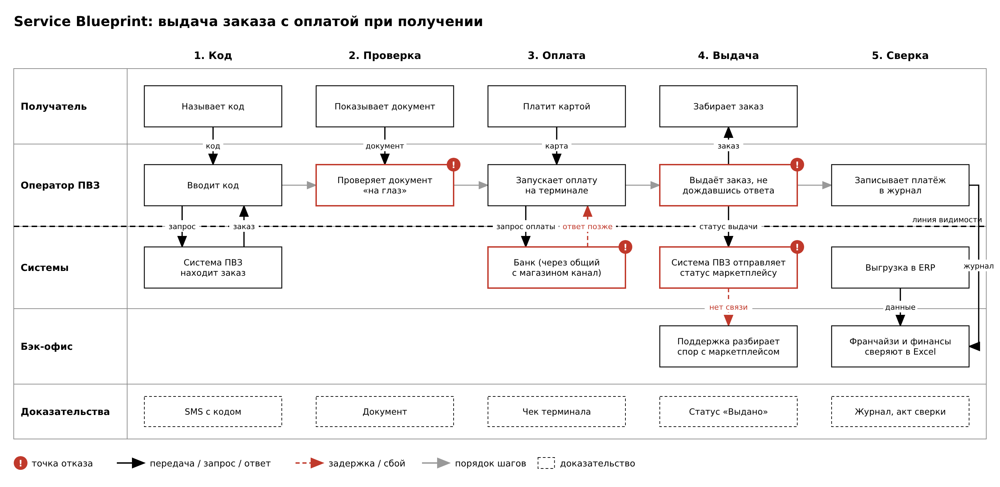

# Experience Pack

## 1. Роль и условия её работы

**Роль:** оператор ПВЗ на совмещённой площадке «магазин + ПВЗ» (точкой управляет франчайзи).

Мы выбрали эту роль, потому что у неё возникают все проблемы, которые мы описали в первом разделе: выдача без подтверждённой оплаты, ручные сверки, споры с франчайзи и общий канал связи с магазином.

**Задача:** выдать заказ нужному человеку, принять оплату и закрыть смену без расхождений.

**Условия работы:**

* **Высокая цена ошибки.** Если заказ выдан, а оплата не подтвердилась, вернуть товар уже нельзя. Ошибка с получателем тоже необратима: заказ ушёл не тому человеку.
* **Стресс и темп.** Почти половина клиентов приходит с 17:00 до 18:00, очередь до 15 минут. В это же время может приехать рейс. Из-за очереди хочется выдать заказ, не дожидаясь ответа терминала.
* **Разграничение прав.** У оператора, старшего смены и франчайзи разные полномочия. На совмещённой площадке продавец магазина может работать за тем же компьютером, и тогда непонятно, кто сделал операцию.
* **Нестабильная связь.** У магазина и ПВЗ один канал связи. Когда загружена касса магазина, ответы от банка и маркетплейса приходят с задержкой или теряются.

## 2. User Journey: выдача заказа с оплатой при получении

**Нормальный путь:**

| Шаг | Что делает оператор | Где | Нагрузка | Боль |
|---|---|---|---|---|
| 1 | Вводит код клиента | Система ПВЗ | Низкая | — |
| 2 | Ищет заказ на полке | Система ПВЗ, полка | Средняя | Ячейка в системе может быть неактуальной |
| 3 | Проверяет документ или код | Получатель | Средняя | Проверка «на глаз», нет чёткого правила |
| 4 | Запускает оплату на терминале | Терминал банка | Высокая | Нужно переключаться между системой и терминалом |
| 5 | Ждёт ответа банка | Терминал | Высокая | Ответ идёт до 20 секунд, в пик дольше, а очередь ждёт |
| 6 | Отдаёт заказ и чек | Получатель | — | Часто отдаёт заказ, не дождавшись ответа |
| 7 | Нажимает «Выдано» | Система ПВЗ → маркетплейс | Низкая | Не видно, дошёл ли статус до маркетплейса |
| 8 | Записывает платёж в журнал | Бумажный журнал | Средняя | Одни и те же данные записывают несколько раз, возможны ошибки |

**Исключения:**

1. **Оплата ушла, а ответа нет.** Сейчас оператор либо выдаёт заказ на доверии, либо проводит оплату ещё раз, и тогда деньги могут списаться дважды. Как должно быть: выдача блокируется, система сама узнаёт статус платежа, повторно оплату не запускают.
2. **Связь пропала после выдачи.** Сейчас статус не доходит до маркетплейса, он считает заказ невыданным, и начинается спор. Как должно быть: выдача сохраняется на точке и отправляется автоматически, когда связь вернётся.
3. **Получатель не прошёл проверку** (чужой код, нет доверенности). Сейчас оператор решает сам и иногда уступает клиенту. Как должно быть: заказ не выдаётся, оператор зовёт старшего, отказ фиксируется в системе.

## 3. Service Blueprint

## 4. Точки отказа

| Точка отказа | Последствие | Связь с потерями | Защита | Владелец |
|---|---|---|---|---|
| Выдача до ответа банка | Товар отдан, денег нет | Неподтверждённые платежи, ~450 млн ₽/год | Выдавать только после успешной оплаты | Финансовый директор |
| Статус выдачи не дошёл до маркетплейса | Спор с маркетплейсом, компенсация | Неподтверждённые платежи | Сохранять выдачу на точке и досылать, пока сервер не подтвердит | Руководитель сети ПВЗ |
| Повторная оплата, когда ответа нет | Двойное списание, жалоба клиента | Репутационный ущерб, потеря клиентов | Не запускать новую оплату, пока неизвестен статус первой | Финансовый директор |
| Проверка получателя «на глаз» | Заказ получил не тот человек | Репутационный ущерб, потеря клиентов | Чёткое правило проверки; если не совпало, зовём старшего | Руководитель сети ПВЗ |
| Журнал и Excel у франчайзи | Расхождения, споры о недостаче | Споры с франчайзи, ~4,2 млн ₽/год | Автоматический реестр смены, связанные записи | Финансовый директор |
| Общий канал с магазином | Долгое ожидание у терминала, очередь | Простои на совмещённых площадках, ~36,4 млн ₽/год | Приоритет для трафика ПВЗ | Руководитель сети ПВЗ |

## 5. Требования

| № | Требование | Тип | Источник | Как проверить |
|---|---|---|---|---|
| 1 | Кнопка «Выдать» доступна только после проверки получателя и успешной оплаты. Если статус оплаты неизвестен, система показывает «Платёж не определён» | FR | Выдача до ответа банка | В логах пилота нет ни одной выдачи без подтверждённой оплаты |
| 2 | Выдача сохраняется на точке с уникальным ID и отправляется повторно, пока сервер её не подтвердит. Повторная отправка не создаёт дубль | FR | Статус не дошёл до маркетплейса | Отключить сеть после выдачи и включить снова: на сервере ровно одна запись |
| 3 | Пока статус первой оплаты неизвестен, новую оплату запустить нельзя | FR | Повторная оплата | Сымитировать зависание терминала: деньги списываются один раз |
| 4 | В конце смены система сама формирует реестр «заказ – оплата – выдача» и список расхождений и выгружает их в ERP | FR | Журнал и Excel | Сравнить время закрытия смены и число расхождений до и после |
| 5 | На совмещённой площадке ответ на запуск оплаты приходит не дольше 2 секунд в 95% случаев, даже когда загружена касса магазина | NFR | Общий канал | Нагрузочный тест на стенде «касса + ПВЗ» |
| 6 | Без связи точка работает до 4 часов: можно принимать и искать заказы, выдача с оплатой при получении приостановлена | NFR | Нестабильная связь | 4 часа без сети, затем синхронизация без потерь и дублей |

## 6. Шесть сценариев

| Сценарий | Что делает оператор | Что сохраняется | Что запрещено | Кто разбирает |
|---|---|---|---|---|
| Рейс приходит, когда есть очередь | Продолжает выдавать, рейс принимает позже | Время прибытия рейса | Выдавать заказы из непринятого рейса | Старший смены |
| Связь пропала после выдачи | Ничего не повторяет, видит «ожидает отправки» | Запись о выдаче на точке | Оформлять выдачу ещё раз | Система, при ошибке поддержка |
| Получатель не прошёл проверку | Не выдаёт, зовёт старшего | Отказ и его причина | Выдавать под давлением клиента | Старший смены |
| Оплата ушла, ответа нет | Не выдаёт, ждёт статус или просит клиента прийти позже | ID платежа | Выдавать заказ и запускать оплату заново | Финансы, поддержка |
| Новичок сталкивается со спорной ситуацией | Видит подсказку на экране, передаёт старшему | Задача на разбор | Решать самому | Старший смены |
| Сломался сканер, принтер или терминал | Сканер: вводит код вручную. Принтер: отправляет электронный чек. Терминал: выдаёт только оплаченные заранее заказы | Отметка о поломке | Повторять оплату из-за того, что нет чека | ИТ-поддержка |

**Гипотезы, которые нужно проверить:**
* операторы выдают заказ до ответа банка, особенно в пик;
* на совмещённых площадках ответа терминала ждут дольше, чем на обычных ПВЗ;
* продавцы магазина работают под учётной записью оператора;
* когда терминал зависает, оператор проводит оплату повторно.

**Открытые вопросы:**
* Можно ли без связи выдавать заказ, оплаченный заранее?
* Кто платит за недостачу, если она возникла из-за сбоя системы, а не по вине франчайзи?
* Какие документы нужны, чтобы забрать заказ за другого человека?
