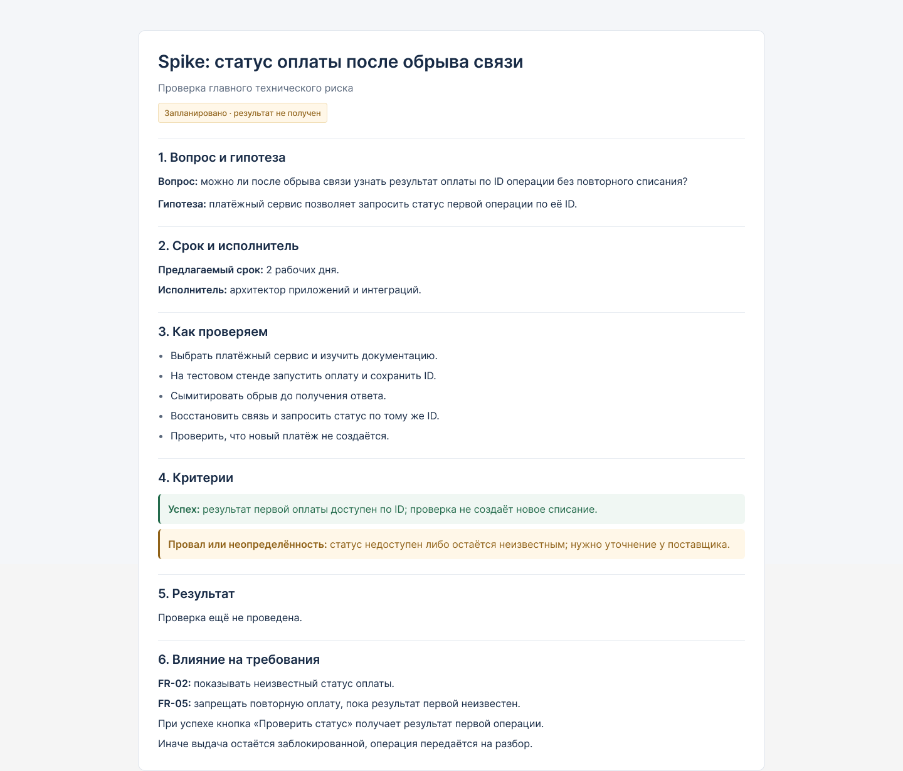

# Реестр требований: выдача заказа в ПВЗ

Роль: оператор ПВЗ на площадке «магазин + ПВЗ».

Сценарий: выдача заказа с оплатой при получении.

## 1. Функциональные требования (FR)

| ID | Формулировка по EARS | Источник в Experience Pack | MoSCoW | Способ проверки | Статус |
|---|---|---|---|---|---|
| FR-01 | Пока получатель не проверен или успешная оплата не подтверждена, система должна блокировать кнопку «Выдать». | Требование №1 | Must | Проверить доступность кнопки при разных статусах | Предложено |
| FR-02 | Если статус оплаты неизвестен, система должна показывать «Платёж не определён». | Требование №1 | Must | Сымитировать отсутствие ответа об оплате | Предложено |
| FR-03 | Когда оператор фиксирует выдачу, система должна сохранять событие на точке с уникальным ID. | Требование №2 | Must | Проверить локальную запись события | Предложено |
| FR-04 | Пока сервер не подтвердил получение события выдачи, система должна повторять отправку с тем же ID при наличии связи. | Требование №2 | Must | Отключить связь и восстановить её | Предложено |
| FR-05 | Пока статус первой оплаты неизвестен, система должна запрещать запуск новой оплаты этого заказа. | Требование №3 | Must | Попытаться повторить оплату при неизвестном статусе | Предложено |
| FR-06 | Когда смена завершается, система должна формировать реестр «заказ — оплата — выдача» и список расхождений для выгрузки в ERP. | Требование №4 | Should | Закрыть тестовую смену и проверить данные в ERP | Предложено |

## 2. Критерии приёмки FR

| ID | Дано | Когда | Тогда |
|---|---|---|---|
| FR-01 | Получатель не проверен или оплата не подтверждена | Оператор открывает заказ | Кнопка «Выдать» заблокирована. После обеих успешных проверок она доступна |
| FR-02 | Статус оплаты неизвестен | Оператор смотрит заказ | Показано «Платёж не определён» |
| FR-03 | Выдача разрешена | Оператор фиксирует выдачу | Событие сохранено на точке с уникальным ID |
| FR-04 | Событие сохранено, подтверждения сервера нет | Связь восстанавливается | Событие отправляется с прежним ID. После подтверждения повторная отправка прекращается |
| FR-05 | Статус первой оплаты неизвестен | Оператор пытается запустить новую оплату | Новый запрос оплаты не отправляется |
| FR-06 | Есть операции смены и заказ без подтверждения выдачи; ERP доступна | Оператор закрывает смену | Реестр и список расхождений сформированы и выгружены в ERP. Заказ без подтверждения отмечен как расхождение |

## 3. Нефункциональные требования (NFR)

| ID | Формулировка | Источник в Experience Pack | MoSCoW | Способ проверки | Статус | Архитектурно значимое |
|---|---|---|---|---|---|---|
| NFR-01 | Ответ на запуск оплаты приходит не дольше 2 секунд в 95% случаев при загруженной кассе магазина. | Требование №5 | Must | Нагрузочный тест «касса + ПВЗ» | Предложено | Да |
| NFR-02 | Без связи приём и поиск заказов доступны в течение 4 часов. Выдача с оплатой при получении приостановлена. | Требование №6 | Must | Работа точки 4 часа без сети | Предложено | Да |
| NFR-03 | После 4 часов без связи все сохранённые события передаются на сервер без потерь. | Проверка требования №6 | Must | Сравнить локальные события и записи сервера после синхронизации | Предложено | Да |
| NFR-04 | Повторная отправка одного события выдачи не создаёт дополнительные записи выдачи на сервере. | Требование №2 | Must | Несколько раз отправить событие с одним ID | Предложено | Да |

## 4. Измеримые сценарии NFR

| ID | Источник воздействия | Событие | Условия | Компонент | Реакция | Мера |
|---|---|---|---|---|---|---|
| NFR-01 | Оператор | Запускает оплату | Касса магазина загружена | Система ПВЗ и платёжная интеграция | Приходит ответ на запуск оплаты | Не более 2 секунд в 95% случаев |
| NFR-02 | Канал связи | Связь пропадает | Точка работает без сети | Локальная система ПВЗ | Приём и поиск доступны; выдача с оплатой при получении заблокирована | 4 часа работы |
| NFR-03 | Канал связи | Связь возвращается | Точка работала 4 часа без сети | Хранилище событий и синхронизация | Сохранённые события передаются на сервер | 0 потерянных событий |
| NFR-04 | Система ПВЗ | Повторно отправляет событие | Событие уже принято сервером | Сервер обработки выдачи | Повтор не создаёт новую выдачу | 1 запись на уникальный ID |

# Проверка прототипа

Участники: 3 сокомандника, не операторы ПВЗ.
Версия: v0.2.
Ссылка на прототип: https://www.figma.com/make/tkISqu3lLcPHf23IPkLvWy/Clickable-Desktop-Prototype?fullscreen=1&t=xESSCBhYqpp3D5JG-1&code-node-id=0-6.

Пример с вымышленными результатами. Результаты и исправление нужно подтвердить после теста.

## Результаты

| Участник | Сценарий | Результат | Замечания |
|---|---|---|---|
| 1 | Обычная выдача | Справился без помощи | Нет |
| 2 | Связь пропала после выдачи | Справился, выдачу не повторял | На экране забыли объяснить, отправится ли запись автоматически после восстановления связи |
| 3 | Платёж неизвестен | Проверил статус, не повторял оплату и не выдавал заказ до подтверждения | Нет |
| 3 | Нет связи до оплаты | Увидел ограничения и отложил выдачу | Нет |

## Исправление в примере

На экран «Заказ выдан — ожидает отправки» добавлен текст:

«Запись сохранена на точке и отправится автоматически после восстановления связи. Повторять выдачу не нужно».

Версия прототипа обновлена до v0.2.

## Вывод

Все участники справились. Замечание помогло сделать поведение при потере связи понятнее.

# Spike: статус оплаты после обрыва связи

Подготовлена карточка исследования: можно ли узнать результат оплаты по ID операции без повторного списания.

Статус: запланировано, проверка ещё не проведена.

