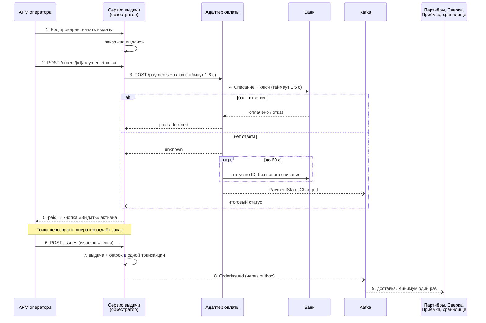

# Сага «выдача с оплатой при получении»

Диаграмма последовательности. Описание шагов и компенсаций — в [07-integrations.md](../07-integrations.md).

```mermaid
sequenceDiagram
    participant ARM as АРМ оператора
    participant ISS as Сервис выдачи<br/>(оркестратор)
    participant PAY as Адаптер оплаты
    participant BANK as Банк
    participant K as Kafka
    participant SUB as Партнёры, Сверка,<br/>Приёмка, хранилище

    ARM->>ISS: 1. Код проверен, начать выдачу
    ISS->>ISS: заказ «на выдаче»
    ARM->>ISS: 2. POST /orders/{id}/payment + ключ
    ISS->>PAY: 3. POST /payments + ключ (таймаут 1,8 с)
    PAY->>BANK: 4. Списание + ключ (таймаут 1,5 с)
    alt банк ответил
        BANK-->>PAY: оплачено / отказ
        PAY-->>ISS: paid / declined
    else нет ответа
        PAY-->>ISS: unknown
        loop до 60 с
            PAY->>BANK: статус по ID, без нового списания
        end
        PAY--)K: PaymentStatusChanged
        K--)ISS: итоговый статус
    end
    ISS-->>ARM: 5. paid → кнопка «Выдать» активна
    Note over ARM,ISS: Точка невозврата: оператор отдаёт заказ
    ARM->>ISS: 6. POST /issues (issue_id = ключ)
    ISS->>ISS: 7. выдача + outbox в одной транзакции
    ISS--)K: 8. OrderIssued (через outbox)
    K--)SUB: 9. доставка, минимум один раз
```
